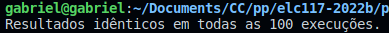
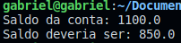
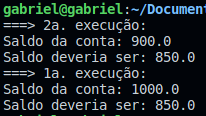

# Prática: Programação Concorrente em Java
## Objetivos
Nesta prática você vai exercitar mais conceitos de programação concorrente e orientada a objetos em Java. Em particular, vamos trabalhar com sincronização de threads, para tratar condições de corrida (race conditions) no acesso a dados compartilhados.

# Resultado
## Testes com 'syncronized'
Após vários testes mantendo a declaração 'syncronized' foi possível constatar que o resultado se manteve consistente com a previsão em todas as execuções

### resultado de uma execução correta

---

### Resultado de várias execuções corretas

---

## Testes sem 'syncronized'
Após a remoção da declaração 'syncronized' os resultados passaram a variar bastante, sendo raro até mesmo duas execuções identicas simultaneamente.

Isso se deve pelo fato de as execuções estarem acessando a mesma área da memória sem nenhum controle, como dito em aula, permitindo a leitura e escrita de informações em ordens distintas a cada execução e com resultados diferentes.

### Resultado de uma execução incorreta

---

### Resultado de várias execuções incorretas

---
